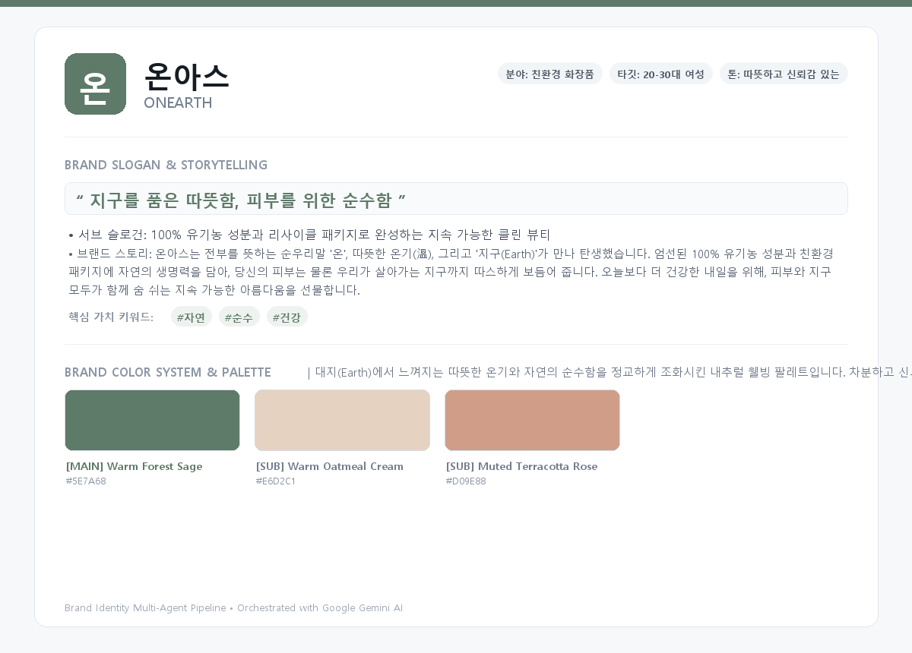
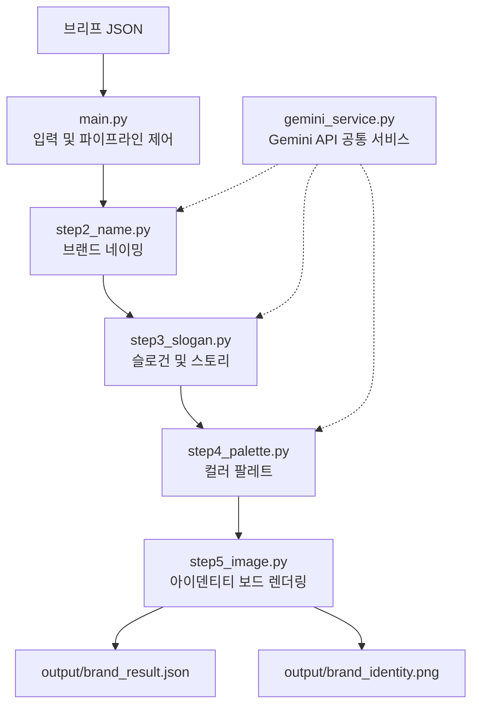

# AI 브랜드 아이덴티티 생성기

브랜드 브리프 하나로 네이밍, 슬로건, 브랜드 스토리, 컬러 팔레트와 브랜드 아이덴티티 보드를 생성하는 CLI 기반 Python 프로젝트입니다. `main.py`가 전체 흐름과 파일 입출력을 관리하고, 각 전문 에이전트가 이전 단계의 결과를 이어받아 순차적으로 브랜드 아이덴티티를 완성합니다.

## 주요 기능

- JSON 형식의 브랜드 브리프 입력 및 필드 정규화
- Google Gemini API를 활용한 한글·영문 브랜드 네이밍 후보 생성
- 메인/서브 슬로건과 브랜드 스토리 생성
- 메인 컬러와 서브 컬러를 포함한 브랜드 컬러 시스템 생성
- Pillow를 활용한 브랜드 아이덴티티 보드 PNG 렌더링
- 전체 텍스트 결과를 `brand_result.json`으로 저장
- API 키 누락, 모델 호출 실패 또는 응답 파싱 실패 시 기본 결과로 파이프라인 계속 진행

## 결과 예시

기본 예제 브리프로 실행하면 다음과 같은 브랜드 아이덴티티 보드가 생성됩니다.



생성되는 주요 정보는 다음과 같습니다.

- 선정 브랜드명과 영문명
- 네이밍 의미 및 전체 후보 목록
- 메인/서브 슬로건, 브랜드 스토리, 핵심 메시지
- HEX 코드, 색상명, 선정 의미를 포함한 컬러 팔레트
- 브랜드 요소를 한 장에 정리한 PNG 보드

## 파이프라인 구조

프로젝트는 중앙 집중형 I/O와 단계별 책임 분리를 적용한 오케스트레이터 패턴으로 구성되어 있습니다.



| 단계 | 모듈 | 역할 | 주요 반환값 |
| --- | --- | --- | --- |
| 1 | `main.py` | 브리프 로드, 정규화, 단계별 호출, 결과 저장 | 정규화된 브리프 |
| 2 | `step2_name.py` | 네이밍 후보와 의미 생성 | 네이밍 목록 |
| 3 | `step3_slogan.py` | 슬로건, 스토리, 핵심 메시지 생성 | 슬로건 정보 |
| 4 | `step4_palette.py` | 브랜드 맥락에 맞는 컬러 시스템 생성 | 메인/서브 팔레트 |
| 5 | `step5_image.py` | 모든 결과를 브랜드 보드로 렌더링 | PNG 이미지 바이트 |
| 공통 | `gemini_service.py` | API 키 확인, Gemini 모델 호출, JSON 응답 파싱 | Gemini 응답 문자열 |

`step2_name.py`부터 `step5_image.py`까지는 파일을 직접 저장하지 않고 메모리상의 데이터만 반환합니다. 실제 파일 생성은 `main.py`에서 담당합니다.

## 프로젝트 구성

```text
4project/
├── main.py                 # CLI 진입점 및 오케스트레이터
├── gemini_service.py       # Gemini API 공통 호출 서비스
├── step2_name.py           # 네이밍 전문 에이전트
├── step3_slogan.py         # 슬로건·스토리 전문 에이전트
├── step4_palette.py        # 컬러 팔레트 전문 에이전트
├── step5_image.py          # 브랜드 보드 렌더링 모듈
├── brief.json              # 기본 브리프 예시
├── input/
│   └── brand_source.json   # 대체 입력 예시
└── output/
    ├── brand_result.json   # 통합 텍스트 결과
    └── brand_identity.png  # 브랜드 아이덴티티 보드
```

## 실행 환경

- Python 3.10 이상
- Google Gemini API 키
- 인터넷 연결(API 기반 결과를 생성할 경우)

### 필요한 패키지

```bash
pip install -U google-genai python-dotenv Pillow
```

## 설치 및 API 키 설정

저장소를 내려받고 프로젝트 폴더로 이동합니다.

```bash
git clone https://github.com/JEONG-HEEEON/4project.git
cd 4project
```

가상 환경 사용을 권장합니다.

```bash
python -m venv .venv
```

macOS/Linux:

```bash
source .venv/bin/activate
```

Windows PowerShell:

```powershell
.venv\Scripts\Activate.ps1
```

프로젝트 루트에 `.env` 파일을 만들고 Google AI Studio에서 발급받은 키를 설정합니다.

```dotenv
GEMINI_API_KEY=your_api_key_here
```

`GOOGLE_API_KEY`도 사용할 수 있습니다. API 키는 소스 코드나 공개 저장소에 직접 올리지 마세요.

## 브리프 작성

입력 파일은 UTF-8로 저장된 JSON 객체여야 합니다.

```json
{
  "industry": "친환경 화장품",
  "target": "20-30대 여성",
  "keywords": ["자연", "순수", "건강"],
  "tone": "따뜻하고 신뢰감 있는",
  "competitors": ["이니스프리", "아로마티카"],
  "notes": "지속 가능한 패키징과 유기농 성분을 강조하는 비건 화장품 브랜드"
}
```

| 필드 | 필수 여부 | 형식 | 설명 |
| --- | --- | --- | --- |
| `industry` | 필수 | 문자열 | 브랜드의 업종 또는 분야 |
| `target` | 필수 | 문자열 | 핵심 고객층 |
| `keywords` | 필수 | 문자열 배열 | 브랜드 핵심 가치와 연상 키워드 |
| `tone` | 선택 | 문자열 | 브랜드 톤앤매너 |
| `competitors` | 선택 | 문자열 배열 | 주요 경쟁 브랜드 |
| `notes` | 선택 | 문자열 | 추가 요구사항과 브랜드 설명 |

호환성을 위해 `domain`, `target_audience`, `core_values`, `description` 키도 각각 대응되는 표준 필드로 정규화됩니다. 선택 필드가 없으면 기본값이 적용됩니다.

## 실행 방법

### 기본 브리프 사용

인자 없이 실행하면 프로젝트 루트의 `brief.json`을 먼저 찾습니다.

```bash
python main.py
```

기본 파일 탐색 순서는 다음과 같습니다.

1. `brief.json`
2. `input/brief.json`
3. `input/brand_source.json`

### 브리프와 출력 폴더 지정

```bash
python main.py brief.json --output output
```

짧은 옵션도 사용할 수 있습니다.

```bash
python main.py input/brand_source.json -o custom_output
```

실행 중에는 현재 처리 중인 단계와 생성 결과가 터미널에 순서대로 출력됩니다.

## 출력 파일

```text
output/
├── brand_result.json
└── brand_identity.png
```

### `brand_result.json`

다음 구조로 모든 텍스트 결과를 저장합니다.

```json
{
  "brief": {},
  "selected_naming": {},
  "all_naming_candidates": [],
  "slogan_and_story": {},
  "color_palette": {
    "main": {
      "hex": "#5E7A68",
      "name": "Warm Forest Sage",
      "meaning": "메인 컬러의 의미"
    },
    "sub": [],
    "mood_description": "팔레트의 전체적인 무드"
  }
}
```

### `brand_identity.png`

브랜드명, 슬로건, 스토리, 키워드와 컬러 팔레트를 1200×860 크기의 이미지 보드로 시각화합니다. 이미지는 메모리에서 생성된 뒤 `main.py`가 PNG 파일로 저장합니다.

## 오류 처리와 폴백

- `GEMINI_API_KEY` 또는 `GOOGLE_API_KEY`가 없으면 Gemini 호출 대신 각 단계의 기본 결과를 사용합니다.
- 특정 Gemini 모델 호출이 실패하면 `gemini_service.py`의 다음 후보 모델로 재시도합니다.
- API 응답이 비어 있거나 JSON 파싱에 실패하면 해당 에이전트의 기본 결과를 사용해 다음 단계를 계속합니다.
- 입력 파일을 찾을 수 없거나 JSON 파일 자체를 읽을 수 없으면 오류 메시지를 출력하고 종료 코드 `1`로 종료합니다.
- 렌더링에 사용할 시스템 글꼴을 찾지 못하면 Pillow 기본 글꼴을 사용합니다.

API 키 없이도 전체 파이프라인과 이미지 렌더링 흐름은 확인할 수 있지만, 이 경우 브랜드별 AI 맞춤 결과가 아닌 내장된 예시 결과가 생성됩니다.

## 주요 함수 인터페이스

```python
# 네이밍 후보
run_naming_agent(brief: dict) -> list[dict]

# 슬로건 및 브랜드 스토리
run_slogan_agent(brief: dict, naming_data: dict) -> dict

# 컬러 팔레트
run_palette_agent(brief: dict, naming_data: dict, slogan_data: dict) -> dict

# 브랜드 보드 PNG
generate_brand_identity_board(brand_data: dict) -> bytes
```

아키텍처 문서의 기본 인터페이스와 연동할 수 있도록 `generate_brand_name`, `generate_slogan`, `generate_color_palette`, `generate_brand_image` 호환 래퍼도 제공합니다.

## 미션 요구사항 대응 현황

| 요구사항 | 현재 구현 |
| --- | --- |
| JSON 브랜드 브리프 입력 | 지원 |
| AI 브랜드 네이밍과 의미 생성 | 지원, 현재 후보 2개 생성 |
| 슬로건과 브랜드 스토리 생성 | 지원, 현재 메인/서브 슬로건 생성 |
| 메인/서브 컬러와 HEX 코드 생성 | 지원 |
| 컬러 팔레트 시각화 | 브랜드 아이덴티티 보드 안에 포함 |
| 텍스트 결과 JSON 저장 | `brand_result.json`으로 지원 |
| 이미지 결과 PNG 저장 | `brand_identity.png`로 지원 |
| 환경 변수를 통한 API 키 관리 | 지원 |
| API 실패 후 다음 단계 진행 | 기본 결과 폴백으로 지원 |
| 대화형 `print`/`input` 입력 | 현재 위치 인자와 옵션을 사용하는 CLI 방식 |
| 네이밍 후보 3~5개 및 슬로건 3개 | 현재 각각 2개와 메인/서브 2개 |
| 이미지 생성 API 기반 로고 시안 2~3개 | 현재 Pillow 기반 아이덴티티 보드 1개 생성 |

## 확장 방향

- 네이밍 후보를 3~5개, 슬로건을 3개로 확장
- `input()` 기반 대화형 실행 모드 추가
- 컬러 팔레트 전용 PNG 파일 분리 생성
- 이미지 생성 API를 연결해 로고 시안 2~3개 저장
- HEX 코드와 API 응답 스키마에 대한 자동 검증 강화
- 단위 테스트와 통합 테스트 추가
